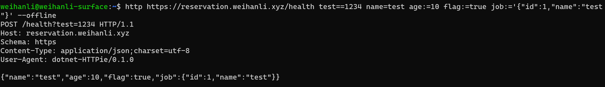

# dotnet-HTTPie

[](https://www.nuget.org/packages/dotnet-httpie/)

[](https://www.nuget.org/packages/dotnet-httpie/absoluteLatest)

[](https://github.com/WeihanLi/dotnet-httpie/actions/workflows/dotnet.yml)

[](https://hub.docker.com/r/weihanli/dotnet-httpie/tags)

## Intro

dotnet tool version of [httpie](https://github.com/httpie/httpie), Modern, user-friendly command-line HTTP client for the API era.


HTTPie (pronounced aitch-tee-tee-pie) is a command-line HTTP client. Its goal is to make CLI interaction with web services as human-friendly as possible. HTTPie is designed for testing, debugging, and generally interacting with APIs & HTTP servers.

## Install

Install .NET SDK before you get started with this tool, when you had .NET SDK installed, run the command below to install the latest stable version tool

``` bash
dotnet tool update --global dotnet-httpie
```

For latest preview version, run the following command instead:

``` bash
dotnet tool update --global dotnet-httpie --prerelease
```

## GetStarted

Now you can use the tool to call your API you want

Usages:

> dotnet-http [flags] [METHOD] URL [ITEM [ITEM]]

There're three types of item

Type | Grammar
-----|-------
Query| name`==`test
Header| X-Api-Key`:`test
Request-Data | name`=`test, raw data field example(Only effective for JSON): age`:=`10, job`:=`'{"Id":1,"Name":"test"}'(Escape may needed for Windows cmd or Windows PowerShell)

Here's a sample:

``` sh
dotnet-http https://reservation.weihanli.xyz/health test==1234 name=test age:=10 flag:=true job:='{"id": 1, "name": "test"}' api-key:Abc12345 --offline
```



More examples you may wanna have a look

``` bash
dotnet-http :5000/api/values
dotnet-http localhost:5000/api/values
dotnet-http get https://reservation.weihanli.xyz/api/notice --body
dotnet-http /api/notice title=test body=test-body
dotnet-http post http://localhost/api/notice title=test body=test-body
```

## Execute

You can execute `*.http`/`*.rest` http requests with the `exec` command

``` sh
dotnet-http exec HttpStartedSample.http

dotnet-http exec ".\tests\HTTPie.IntegrationTest\TestAssets\HttpStartedSample.http"
dotnet-http exec ".\tests\HTTPie.IntegrationTest\TestAssets\HttpVariableSample.http"
dotnet-http exec ".\tests\HTTPie.IntegrationTest\TestAssets\HttpRequestReferenceSample.http"
```

see http request sample here: <https://github.com/WeihanLi/dotnet-httpie/tree/dev/tests/HTTPie.IntegrationTest/TestAssets>

## Docker

There's a docker image(weihanli/dotnet-httpie) that you could use directly without installing the tool, use sample:

``` bash
docker run --rm --pull=always weihanli/dotnet-httpie:latest -v github.com

docker run --rm --pull=always weihanli/dotnet-httpie:latest reservation.weihanli.xyz/health job:='{"id":1,"name":"tester"}' --offline

docker run --rm --pull=always weihanli/dotnet-httpie:latest PUT httpbin.org hello=world

docker run --rm --pull=always weihanli/dotnet-httpie:latest get httpbin.org/status/400
```

## More

For detailed document: have a look at HTTPie documents <https://httpie.io/docs#examples>

## References

- httpie: <https://github.com/httpie/httpie>
- httpie docs: <https://httpie.io/docs>
- Curl to HTTPie request tool: <https://curlipie.now.sh/>
