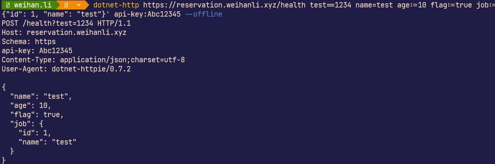

# dotnet-HTTPie

[](https://www.nuget.org/packages/dotnet-HTTPie/)

[](https://www.nuget.org/packages/dotnet-HTTPie/absoluteLatest)

[](https://github.com/WeihanLi/dotnet-HTTPie/actions?query=workflow%default+branch%3Adev)

## Intro

dotnet tool version of HTTPie, Modern, user-friendly command-line HTTP client for the API era.


HTTPie (pronounced aitch-tee-tee-pie) is a command-line HTTP client. Its goal is to make CLI interaction with web services as human-friendly as possible. HTTPie is designed for testing, debugging, and generally interacting with APIs & HTTP servers.

## Install

Install .NET SDK before you get started with this tool, when you had .NET SDK installed, run the command below to install the latest stable version tool

``` bash
dotnet tool install --global dotnet-httpie
```

For latest preview version, run the following command instead:

``` bash
dotnet tool install --global dotnet-httpie --version '*-*'
```

## GetStarted

Now you can use the tool to call your API you want

Usages:

> http [flags] [METHOD] URL [ITEM [ITEM]]

There're three types of item

Type | Grammer
-----|-------
Query| name`==`test
Header| X-Api-Key`:`test
Request-Data | name`=`test, raw data field example(Only effective for JSON): age`:=`10, job`:=`'{"Id":1,"Name":"test"}'(Escape needed for Windows)

Here's a sample: 

## Docker

There's a docker image(weihanli/dotnet-httpie) that you could use directly without installing the tool, use sample:

``` bash
docker run --rm --pull=always weihanli/dotnet-httpie:latest http -v github.com

docker run --rm --pull=always weihanli/dotnet-httpie:latest http reservation.weihanli.xyz/health job:='{"id":1,"name":"tester"}' --offline

docker run --rm --pull=always weihanli/dotnet-httpie:latest http PUT httpbin.org hello=world

docker run --rm --pull=always weihanli/dotnet-httpie:latest http get httpbin.org/status/400
```

## More

There're some examples you may wanna have a look

``` bash
http :5000/api/values
http localhost:5000/api/values
http get https://reservation.weihanli.xyz/api/notice --body
http post /api/notice title=test body=test-body
```

For detailed document: have a look at HTTPie documents <https://httpie.io/docs#examples>

## References

- HTTPie docs: <https://httpie.io/docs>
- Curl to HTTPie request tool: <https://curlipie.now.sh/>
